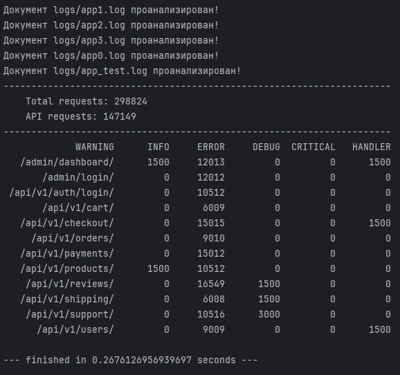

# Асинхронный обработчик логов no import

Проект создан в рамках выполнения
[тестового задания](https://docs.google.com/document/d/1JbnXWtv85z96jxBKLpIxmxfdZt6G6xOyti9AWlNPt1A/edit?tab=t.0#heading=h.ge2y49g7qwcb).

## О проекте: 
- Программа для парсинга файлов логов и создания отчетов.
- Принципиальное ограничение - встроенные библиотеки python (за исключением тестов).
- Файлы логов могут быть размером в несколько гигабайт и более.
- Параллельная обработка нескольких файлов
- Возможность добавления других видов отчетов без переработки кода.

## Как это работает
1. Каждый файл обрабатывается отдельным потоком. Кроме того, каждый поток читает файл "кусками" размера `slice_size`
2. Каждый "кусок" читается целиком при помощи regular expressions. После этого передается в Counter, он превращает большой набор текста в компактный пакет данных, который не содержит ничего лишнего.
3. Обобщенные данные со всех потоков передаются в общую очередь `main_queue`. После того, как все потоки отработали мы проходимся по очереди и суммируем все данные из нее.
4. Полученные данные преобразуем в defaultdict для того, чтобы несуществующие значения вместо ошибки ключа возвращали **0**. Так даже не нужно менять структуру данных, просто проходим двойным циклом по словарю и формируем строки для отчета.
5. Столбцы формируются из множества `headers`, строки `handlers` динамически создаются в зависимости от того, какие методы API встречаются в логах.
6. Последний этап - формирование графического отображения отчета. Он также легко настраивается переменными `col_amt`, `f_col_w`, `col_w`.

## Таким образом получилась гибкая и быстрая система, которую можно настроить под любой другой вид отчетов:
- Для этого достаточно внести изменения в паттерн регулярных выражений и задать ожидаемые заголовки.
- Вся логика программы и отрисовки отчета подстроятся под эти ключевые параметры!

## Замечания и мысли:
- Дополнительный уровень многопоточности на уровне process_slice не дал прироста скорости и был выброшен.

### Связаться со мной
telegram [@YanMolchanov](https://t.me/YanMolchanov).

